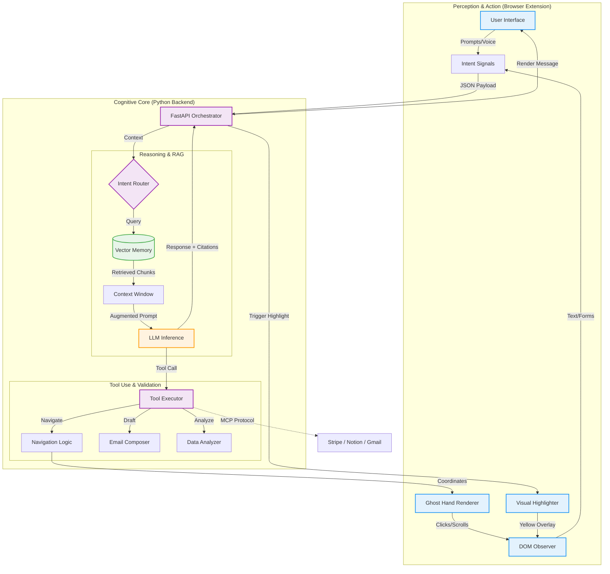

# Ambient Copilot

Ambient Copilot is a browser-integrated agentic assistant designed to provide contextual intelligence, automated navigation, and proactive insights while browsing the web. It leverages a local Large Language Model (LLM) backend to ensure privacy and low-latency performance.

## Agentic Architecture

The system operates on a split-stack architecture designed to mimic human cognitive processes:

1.  **Perception Layer (Extension Frontend)**:
    *   **Context Extraction**: The active tab's content (`content.js`) is continuously analyzed to extract text, identify interactive elements (forms), and detect user selection events.
    *   **Intent Signaling**: User interactions (e.g., highlighting text, voice commands) are converted into structured signals sent to the backend.

2.  **Cognitive Layer (Python Backend)**:
    *   **Intent Detection Engine**: A specialized specialized LLM chain (`actions.py`) analyzes natural language inputs to classify intents (e.g., `navigate_page`, `draft_email`, `save_note`) rather than just generating text.
    *   **RAG (Retrieval-Augmented Generation)**: The system grounds its responses in the actual content of the webpage. It identifies specific quotes and returns them as structured citations.

3.  **Action Layer (Autonomous Execution)**:
    *   **Ghost Hand Auto-Pilot**: The backend transmits coordinate-based navigation commands to the frontend, which simulates a virtual cursor to physically scroll to and click elements on the user's behalf.
    *   **Smart Select**: Context-aware analysis is triggered immediately upon text selection, bypassing the need for manual copy-pasting.

### System Diagram




## Core Features

*   **Contextual Chat Interface**: A persistent, sidebar-style chat window that maintains conversation history and context awareness across different browsing sessions, enabling continuous assistance.
*   **Persistent "Brain" Memory**: The system autonomously stores user preferences, facts, and summarized notes in a local vector database. This "Brain" evolves over time, allowing the agent to recall past interactions and tailor responses to the user's specific needs.
*   **MCP Integrations (Neural Sync)**: A dedicated dashboard for managing secure connections with external tools and APIs (Model Context Protocol). It supports integrations with services like Stripe, Gmail, and Notion, featuring a simulated handshake protocol for credential verification.
*   **Contextual RAG & Interactive Citations**: Answers generated by the assistant include strict citations. Hovering over a citation in the chat interface highlights the corresponding source text on the webpage, verifying the information's accuracy.
*   **Autonomous Navigation (Ghost Hand)**: Users can issue natural language commands (e.g., "Take me to the pricing section"), which the system translates into automated scroll and click actions visualized by a virtual cursor.
*   **Neural Sync Dashboard**: A dedicated interface for managing integrations with external tools (Stripe, Gmail, Notion). It includes a simulated secure handshake protocol for credential verification.
*   **Proactive Form Detection**: The system automatically identifies complex forms on webpages and offers a "Magic Fill" option to populate them based on the user's stored profile and context.
*   **Adaptive Workflow Automation**: The system observes user interactions to learn and automate repetitive workflows. Users can iteratively refine these automated behaviors and navigation paths using natural language prompts or voice commands, allowing the assistant to adapt to specific operational needs over time.
*   **Typeform-Style Onboarding**: A step-by-step configuration wizard that captures user goals, professional context, and response preferences to personalize the agent's behavior.
*   **Advanced Modular Interface**: A high-density, dual-tone professional workspace (Slate & Electric Sky Blue) optimized for multi-tasking and cognitive clarity (480x600 viewport).
*   **Extended Analytical Capabilities**:
    *   **Entity Vision Ticker**: A real-time data streaming ribbon for instant extraction of critical page metadata and entities.
    *   **Neural Load Monitoring**: A specialized system HUD for real-time tracking of computational resource allocation and tool utilization.
    *   **Dynamic Sentiment Analysis**: A biometric-style "Neural Orb" visualizer that adapts to the qualitative tone of active page content.
    *   **Autonomous Blueprint Console**: A synthesis-driven workflow discovery engine that proactively identifies multi-step automation sequences (Blueprints) based on page heuristics. Features a real-time progress visualizer for complex "Stage-Gate" executions.
*   **Contextual Knowledge Base (CRUD)**: A searchable, structured memory repository allowing users to manage, verify, and filter agent context.
*   **Integrated Audio Interface**: High-fidelity voice input processing with active session state visualization.

## Prerequisites

*   **Browser Environment**:
    *   **Recommended**: Google Chrome, Arc, or Brave (Chromium 100+).
    *   **Note**: While basic features function across most standard browsers, advanced agentic capabilities (e.g., Ghost Hand navigation, specific MCP visualizers) require full Chromium extension support to operate optimally.
*   **Python**: Version 3.8 or higher.
*   **OpenAI API Key**: Required for the backend LLM processing.

## Setup Instructions

### 1. Backend Configuration

1.  Navigate to the backend directory:
    ```bash
    cd apps/backend
    ```
2.  Create a virtual environment:
    ```bash
    python -m venv venv
    source venv/bin/activate  # On Windows: venv\Scripts\activate
    ```
3.  Install dependencies:
    ```bash
    pip install -r requirements.txt
    ```
4.  Configure environment variables:
    Create a `.env` file in the `apps/backend` directory and add your API key:
    ```
    OPENAI_API_KEY=sk-...
    ```
5.  Start the server:
    ```bash
    python app.py
    ```
    The server will initialize on `http://localhost:8000`.

### 2. Extension Installation & Management

1.  **Prepare the Environment**:
    *   It is recommended to clear your browser cache or use a fresh profile to ensure no conflicts with existing extensions.
    *   Navigate to the Extensions management page (e.g., `chrome://extensions`).
2.  **Enable Developer Mode**: Toggle the "Developer mode" switch in the top-right corner.
3.  **Load the Extension**:
    *   Click "Load unpacked".
    *   Select the `apps/extension` directory from the project folder.
    *   Ensure the extension is enabled and pinned to your toolbar for easy access.
    *   *Note: If you make changes to the code, you must manually reload the extension from this page.*
5.  The extension icon should appear in your browser toolbar.

### 3. Usage

1.  Ensure the backend server is running.
2.  Click the extension icon to open the interface.
3.  Complete the initial onboarding setup.
4.  Navigate to any webpage to begin using Agentic RAG features or Voice Commands.